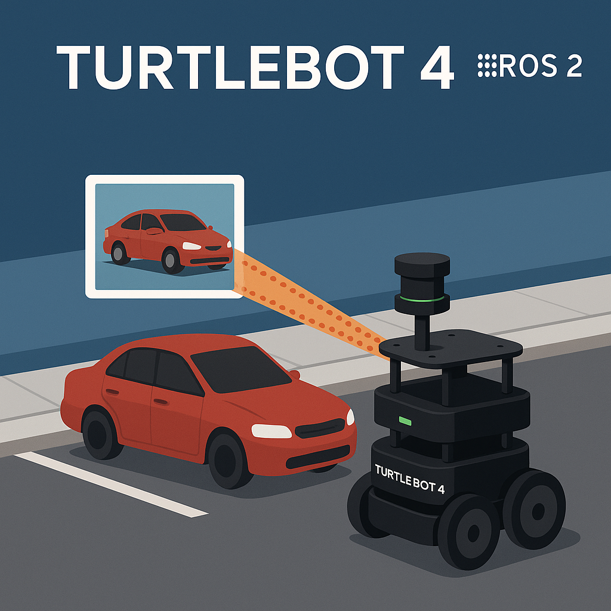

# 🛣️ 탐라는 도로지킴이: 불법 주정차 단속 로봇 시스템

불법 주정차 단속을 위한 **지능형 로봇 시스템** 개발 프로젝트입니다.  
순찰 로봇과 견인 로봇이 협력하여 **24시간 단속 및 즉각 대응**이 가능한 자동화 시스템을 구현했습니다.



## 📌 프로젝트 개요

- **프로젝트명**: 도로지킴이
- **기간**: 2024.05.09 ~ 2024.05.22 (총 2주)
- **기관**: K-Digital Training, 두산로보틱스
- **팀**: TEAM 4 – 불법 주정차 단속팀 (팀장 : 정재종) 
- **멘토**: 손미란 강사님

## 🔍 문제 정의

- 불법 주정차는 과태료 유발뿐 아니라, 보행자 안전 위협 및 도로 소통에 방해됨
- 기존 앱 기반 알림 시스템은 실효성 부족 및 악용 우려
- 효과적인 실시간 자동화 단속 시스템 필요

## 🎯 프로젝트 목표

- 불법 주정차 차량을 탐지하고 위치 좌표를 기록
- 자율 주행 로봇이 해당 차량 근처로 이동 및 견인 절차 수행
- 로봇 간 실시간 통신 및 좌표 전송 자동화

## ⚙️ 시스템 아키텍처

```
[YOLO + Depth] ─→ [Object Detection] ─→ [TF Transform] ─→ [좌표 Publish]
                                                   ↓
                         [순찰 Bot (TurtleBot4)] ←→ [견인 Bot]
```

## 🛠 사용 기술

| 범주           | 내용                                         |
|----------------|----------------------------------------------|
| **AI 모델**     | YOLOv8, Depth Camera                         |
| **로봇 플랫폼** | TurtleBot4 (ROS 2 기반)                     |
| **프레임워크**   | ROS 2, Nav2, TF2, OpenCV, Python            |
| **학습환경**    | Ubuntu 22.04,  VS Code                       |

## 📦 주요 기능

- ✅ YOLOv8을 통한 차량 탐지
- ✅ OpenCV 기반 도로 마스킹 및 색상 감지
- ✅ Depth 센서 기반 거리 추정
- ✅ TF 좌표 변환 → map 기준 위치 파악
- ✅ 순찰 로봇 및 견인 로봇의 분산 협업
- ✅ RViz 기반 마커 시각화 및 좌표 공유

## 🎥 시연 영상

> 📺 [시연 영상 링크](https://www.youtube.com/shorts/tp9fruPbt54)

---

### 주요 파일 설명

- `tow_bot/final_gyenin.py` : 견인 로봇 메인 제어 스크립트
- `patrol_bot/sub_move.py` : 순찰 로봇 이동 제어 스크립트
- `patrol_bot/last_car_tf_pub.py` : 불법주차 차량 감지 스크립트

## 💡 깨달은 점 & 아쉬운 점

- **깨달은 점**
  - 멀티 로봇 협업 설계의 어려움: 두 대의 로봇이 서로 간섭 없이 동작하도록 ROS2 namespace 및 TF 구조를 정확히 설계하는 것이 중요함을 배움
  - YOLO + Depth + Mask 연동: 단일 객체 탐지보다, 실질적 단속 조건(거리, 위치, 색상조건 등)을 함께 고려하는 시스템 통합이 실제 환경에서 더욱 실용적임을 체감
  - ROS2 통합 디버깅의 중요성: 많은 노드와 topic이 동시에 작동하므로, `rqt_graph` 및 `rviz2`로 흐름을 수시로 시각화해 체크하며 설계가 필요함을 느낌
  - 데이터 통신량이 많아 이미지 전처리의 필요성이 컸다. 실제로 고해상도 이미지를 실시간 전송하거나 처리하는 경우, 네트워크 지연(latency)과 처리 병목 현상이 발생
  - 현상을 해결하기 위해 ROI 설정, 리사이징, 그레이스케일 변환, HSV 변환 후 마스크 처리 등의 전처리를 로봇 내부에서 먼저 수행하도록 하여 연산량을 줄임
  - 이를 통해 시스템 응답속도와 안정성이 개선되어 실시간성을 확보

- **아쉬운 점**
  - 터틀봇 기능 한계로 도로 환경 적용에 제약
  - 실제 환경(제주도 등)에 적용 시 더 많은 데이터 필요

